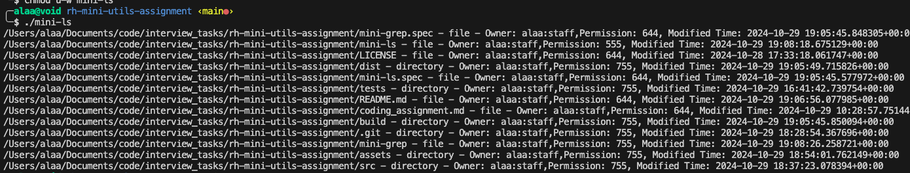

## Table of Contents
- [Mini Utils Assignmnent](#mini-utils-assignmnent)
  - [Description](#description)
  - [Usage](#usage)
    - [mini-grep](#mini-grep)
    - [mini-ls](#mini-ls)
  - [About the Solution](#about-the-solution)
    - [Directory Structure](#directory-structure)
    - [Building The Binaries](#building-the-binaries)
      - [Steps to build the binaries](#steps-to-build-the-binaries)
      - [Usage of the binaries](#usage-of-the-binaries)
    - [General Notes](#general-notes)
- [References](#references)

# Mini Utils Assignmnent
## Description
Solution for "mini-utils" take-home assignment. Using Python, I have chosen to implement two out of the three provided:
- `mini-grep` 
- `mini-ls` 


> [!IMPORTANT]
> If you'd like to use the binaries without ".py", you will need to build them locally. 
> 
> The reason for that being different platforms with different permissions. On macOS, for example, when I tried to download the repo into a different machine, the permissions were not preserved - which caused the binaries to not work (macOS doesn't consider them safe). Fully functional with ".py" extension, though.
> 
> Nevertheless, I've included the binaries in the root directory (`./mini-grep` and `./mini-ls`) - built for macOS, if you'd like to try changing their permissions/allowing from macOS' settings. 
> 
> I have included the instructions to build the binaries in the following sections of this README anyway, so no worries.
>

## Usage 
### mini-grep
*Assuming you're in the root directory of this repo; where this file and [src](./src) resides.*
```bash
# Since I've used argparse, you can use the following command to see the help (-h or --help)
python3 src/mini-grep.py -h
```

```bash
# With stdn -> piping the output of echo to mini-grep
echo 'Hello,\nHow is it going, Joe?' | python3 src/mini-grep.py -e "[o,e]"
```

***Some complex regex examples***

I've included test data for you to test the regexes. You can find it in the `tests` directory.

```bash
# Email regex - runs against `tests/data-to-grep.log`
python3 src/mini-grep.py -e "[a-zA-Z0-9._%+-]+@[a-zA-Z0-9.-]+\.[a-zA-Z]{2,}" tests/data-to-grep.log
```

```bash
# IP Address regex - runs against 'tests/data-to-grep.log' with '-q' flag
python3 src/mini-grep.py -e "\b\d{1,3}\.\d{1,3}\.\d{1,3}\.\d{1,3}\b" tests/data-to-grep.log -q
```

```bash
# Last one to show handling of invalid regex
python3 src/mini-grep.py -e "[\b\d{1,3}\.\d{1,3}\.\d{1,3}\.\d{1,3}\b" tests/data-to-grep.log -q
```

Example mini-grep output:

```
╭─alaa@void rh-mini-utils-assignment ‹main●› 
╰─$ echo 'hello\n123' | python3 src/mini-grep.py -e "[0-9]"
2:123
```


---------------

### mini-ls
*Assuming you're in the root directory of this repo; where this file and [src](./src) resides.*
```bash
# Since I've used argparse, you can use the following command to see the help (-h or --help)
python3 src/mini-ls.py -h
```

```bash
# Runnung mini-ls on the current directory
python3 src/mini-ls.py 
```

```bash
# Recursively (-r or --recursive), should show the sub-dirs under tests/dir-to-ls
python3 src/mini-ls.py -r
```

I've also added a test file ([test/paths-to-ls.log](./tests/paths-to-ls.log)) that points to `/var/log` and this directory's `test/dirs-to-ls`. 

```bash
# Reads test/paths-to-ls.log and lists the information about the paths given in the file
python3 src/mini-ls.py tests/paths-to-ls.log -r
```


Examples mini-ls output:

```
╭─alaa@void rh-mini-utils-assignment ‹main●› 
╰─$  python3 src/mini-ls.py tests/paths-to-ls.log -r          
---OMITTED---
/var/log/uucp - directory - Owner: _uucp:wheel,Permission: 755, Modified Time: 2024-10-12 13:03:21+00:00
/var/log/fsck_apfs.log - file - Owner: root:wheel,Permission: 644, Modified Time: 2024-10-18 16:09:49.316468+00:00
tests/dir-to-ls/sub-dir - directory - Owner: alaa:staff,Permission: 755, Modified Time: 2024-10-29 16:44:18.868580+00:00
tests/dir-to-ls/sub-dir/sub-dir-file - file - Owner: alaa:staff,Permission: 644, Modified Time: 2024-10-29 16:44:43.553972+00:00
tests/dir-to-ls/sub-dir/sub-sub-dir - directory - Owner: alaa:staff,Permission: 755, Modified Time: 2024-10-29 16:44:26.112077+00:00
tests/dir-to-ls/sub-dir/sub-sub-dir/sub-sub-dir-file - file - Owner: alaa:staff,Permission: 644, Modified Time: 2024-10-29 16:44:49.789495+00:00
tests/dir-to-ls/parent-dir-file - file - Owner: alaa:staff,Permission: 644, Modified Time: 2024-10-29 16:44:51.620326+00:00
```


---------

## About the Solution
### Directory Structure
```bash
.
├── LICENSE
├── README.md
├── assets
│   ├── mini-grep-output.png
│   └── mini-ls-output.png
├── coding_assignment.md
├── mini-grep
├── mini-ls
├── src
│   ├── mini-grep.py
│   └── mini-ls.py
└── tests
    ├── data-to-grep.log
    ├── dir-to-ls
    │   ├── parent-dir-file
    │   └── sub-dir
    │       ├── sub-dir-file
    │       └── sub-sub-dir
    │           └── sub-sub-dir-file
    └── paths-to-ls.log
```
### Building The Binaries
- I have used [`pyinstaller`](https://pyinstaller.org/en/stable/) to build the binaries, made sure they can be used as one file without needing dependencies. 
- Tested on macOS (ZSH).

***In case you want to build the binaries yourself, you can run the following commands:***
#### Steps to build the binaries
```bash
# 1. Install pyinstaller
pip install --upgrade pyinstaller  
```

```bash
# 2. Build the binaries, use -F to make a single file
# Make sure you are in the root directory of this repo
pyinstaller -F src/mini-ls.py && pyinstaller -F src/mini-grep.py 
```

Binaries will be in the `dist` directory after the build. I have intentionally not included the binaries in the repo.
```
dist
├── mini-grep
└── mini-ls
```

#### Usage of the binaries
```bash
# Assuming you're in the root directory of this repo
cd dist
./mini-grep -h
./mini-ls -h 
# (You can reference the examples above for testing data)
```

----------

### General Notes
- Both files (`src/mini-grep.py` and `src/mini-ls.py`) are formatted with [`black`](https://black.readthedocs.io/en/stable/the_black_code_style/current_style.html) (uses `PEP8`).
- I intentionally left my commit history in the repo to show the process I followed to implement the solution. I usually condense my commits (squash them) to around 3-4 commits that define significant changest and/or feature additions.
- There are two, very long, docstrings in the source files, which I've left intentionally for quick reference while reviewing the code, they reference the definition shared for the assignment and some logical points I've put down before writing the code.
- All the functions are doc-stringed, to provide a quick reference to what the function does, expects and returns.
- No `requirements.txt` included or needed. I made sure I've used only the standard library modules to keep it simple and easy to run.
  - `argparse` for argument parsing
  - `re` for regex operations
  - `pathlib` for object-oriented filesystem paths
  - `os` for system calls
  - `sys` for system-specific parameters and functions (standard input for mini-grep)
- `src` directory contains the source files for the utilities, while `tests` contains the test data and the test files.
- While the solutions are "simple" implementations, I've tried to handle some edge cases with the if conditions, and added "NOTE"s and "TODO"s where I thought it was necessary to mark a potential improvement or enhancement.

# References
- [YouTube - Argparse Basics](https://www.youtube.com/watch?v=FbEJN8FsJ9U)
- [Official Python docs - Argparse Tutorial](https://docs.python.org/3/howto/argparse.html)
- [Argparse Reference](https://docs.python.org/3/library/argparse.html)
- [re — Regular expression operations](https://docs.python.org/3/library/re.html)
- [pathlib — Object-oriented filesystem paths](https://docs.python.org/3/library/pathlib.html#)
- [Why I choose os.scandir()](https://docs.python.org/3/whatsnew/3.5.html#pep-471-os-scandir-function-a-better-and-faster-directory-iterator)
- [Comparison to the os and os.path modules](https://docs.python.org/3/library/pathlib.html#comparison-to-the-os-and-os-path-modules)
- Since os.stat().st_mode returns file mode bits (permissions), I referenced to this page to understand how to extract the file permissions from the mode bits: [Numeric Notation](https://en.wikipedia.org/wiki/File_system_permissions#Numeric_notation)
